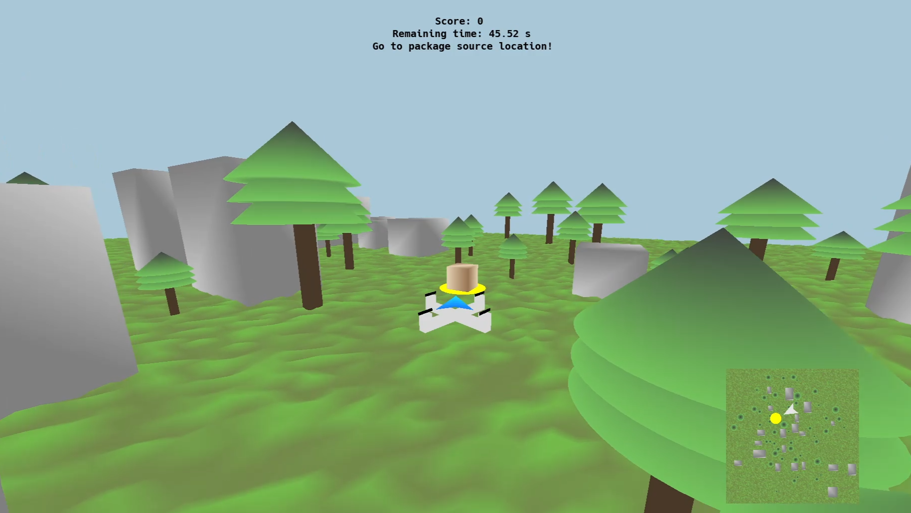
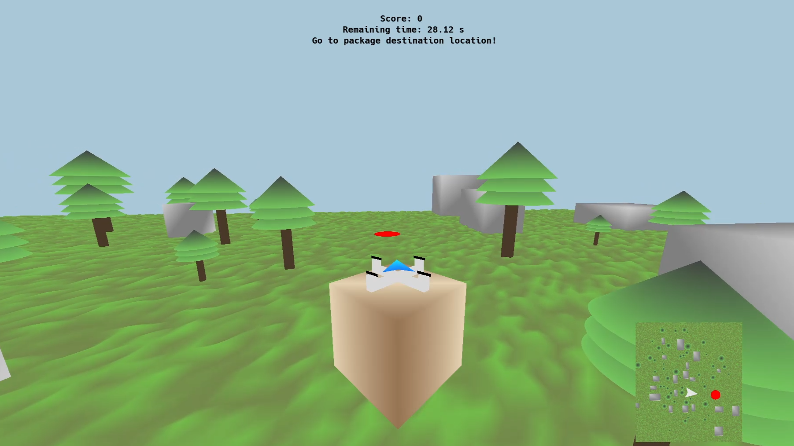

# Drone Package Delivery Minigame

>This is a 3D drone delivery game where the player controls a drone to collect and deliver packages within a period of time. The player navigates through a terrain with trees and buildings as obstacles, earning points for successful deliveries.

## **Table of contents**

1. [Introduction](#introduction)
    - [Game Overview](#game-overview)
    - [Key Features](#key-features)
    - [Supported Platforms](#supported-platforms)
2. [Prerequisites](#prerequisites)
    - [Install a compiler](#install-a-compiler)
    - [Install the third-party libraries](#install-the-third-party-libraries)
    - [Install the build tools](#install-the-build-tools)
3. [Building](#building)
4. [Running](#running)

## Introduction

**Drone Delivery Game** is an immersive 3D simulation game where players pilot a drone through a procedurally generated urban landscape to complete package delivery missions. Built using modern OpenGL graphics programming, the game challenges players to navigate their drone through a detailed environment filled with obstacles while racing against time to deliver packages successfully.

### **Game Overview**

In this fast-paced delivery simulation, players control a drone equipped with four spinning propellers, maneuvering through a terrain filled with randomly placed obstacles. The objective is simple yet engaging: locate packages at their source locations, pick them up, and deliver them to their designated destinations before time runs out. Each successful delivery increases your score, while collisions with buildings or trees will bounce your drone away from obstacles, adding a realistic physics element to the gameplay.

### **Key Features**

**Dynamic Environment Generation**: Every game session features a unique landscape with randomly positioned buildings and trees, ensuring no two playthroughs are identical.

**Intuitive Controls**: Navigate your drone using `WASD` keys for movement while mouse controls provide smooth rotation and altitude adjustment. The game features collision detection that prevents crashes while providing realistic bounce-back effects when encountering obstacles.

**Visual Guidance System**: An integrated arrow system points toward your current objective, whether it's the package pickup location or delivery destination. Additionally, animated location disks with pulsing radius effects help players identify target areas from a distance.

**Minimap Navigation**: A real-time orthographic minimap in the corner of the screen provides a bird's-eye view of the terrain, showing your drone's position, current objectives, and the surrounding environment. This feature is essential for strategic navigation in the complex 3D environment.

**Time-Based Gameplay**: Each round is limited to a certain period of time, creating an intense, arcade-style experience that encourages quick decision-making and efficient route planning.

The game features custom graphics, smooth controls, and detailed 3D models that make it easy to play for both beginners and experienced players.

### Supported Platforms
The game is cross-platform, and supports the following architectures:

-   Windows: `i686`, `x86_64`, `arm64`
-   Linux: `i686`, `x86_64`, `arm64`
-   macOS: `x86_64`, `arm64`

## Prerequisites

This section describes ***what you need to do and install*** before actually building the code.

### Install a compiler

The compiler requirements are listed below. We strongly recommend to always use the latest compiler versions.

-   Minimum:
    -   Windows: Visual Studio 2015 Update 3 with `Programming Languages -> Visual C++` checked when installing
    -   Linux: `g++` version 5
    -   macOS: `clang++` version 4

-   Recommended:
    -   Windows: Visual Studio 2022 with `Workloads -> Desktop development with C++` checked when installing
        -    When installing Visual Studio 2019 or later, double-check that you selected "Desktop development with C++". This should download and install approximately 8 GB of stuff from the Microsoft servers. If you installed Visual Studio and it only took several minutes, you probably missed this step
    -   Linux: `g++` latest
    -   macOS: `clang++` latest, by doing one of the following:
        -   for LLVM/Clang: install [`brew`](https://brew.sh/) then run `brew install llvm`
        -   for Apple Clang: install XCode

### Install the third-party libraries

There are some open-source libraries that this game uses. To install them:

-   Windows: you don't need to do anything - all necessary libraries are already provided with the code

-   Linux: depending on your distribution, run one of the following scripts as superuser:
    -   Debian (Ubuntu): `./tools/deps-ubuntu.sh`
    -   Red Hat (Fedora): `./tools/deps-fedora.sh`
    -   Arch (x86_64): `./tools/deps-arch.sh`

-   macOS: install [`brew`](https://brew.sh/) then run `./tools/deps-macos.sh`

### Install the build tools

This project uses [CMake][ref-cmake]. In a nutshell, CMake does not compile source code, instead it creates files that you then use to compile your code (for example, it creates a Makefile on Linux and macOS, a Visual Studio project on Windows, and so on).

This project requires CMake ***3.16 or newer,*** however, it is recommended to use the latest version. To install it, follow these steps:

-   Windows:
    1.  go to the [CMake downloads page][ref-cmake-dl]
    2.  download the latest version of the file called `cmake-<VERSION>-windows-x86_64.msi`
    3.  install it

-   Linux:
    1.  use your package manager to install `cmake`
    2.  check the version using `cmake --version`
    3.  depending on the version:
        -   if it's the minimum required (see above), you're all set
        -   otherwise, run `./tools/install-cmake.sh && . ~/.profile` in a terminal

-   macOS:
    1.  run `brew install cmake`

After installation, run `cmake --version` to check that it's in your `PATH` environment variable. This should happen automatically, but if it didn't, just add it manually. Instructions on how to add an executable to your `PATH` differ across operating systems and are ***not*** covered here.

## Building

Open a terminal and go into the root folder of the project, which contains the top-level `CMakeLists.txt` file.
Do not run CMake directly from the top-level folder (meaning, do not do this: `cmake .`). Instead, make a separate directory, as follows:

1.  `mkdir build`
2.  `cd build`
3.  Generate the project:
    - `cmake ..`
4.  Build the project:
    -   Windows, one of the following:
        -   `cmake --build .`
        -   or just double-click the `.sln` file to open it in Visual Studio, then press `Ctrl+Shift+B` to build it
    -   Linux and macOS, one of the following:
        -   `cmake --build .`
        -   or just `make`

That's it!

***Note:*** When running the CMake generation step on Windows (meaning, `cmake ..`), you may receive errors that include the phrase `Permission denied`. If you currently have the framework on the `C:` drive, for example on the Desktop, you might not have write permissions. This could happen on single-drive devices (meaning, for example, computers with no disk partition other than `C:`). As an alternative, move the framework on the top-level (directly in `C:`) or create another drive partition (for example `D:`) and move it there.

## Running

You can run the game from an IDE, as well as standalone, from anywhere on disk. For example:

-   Windows, one of the following:
    -   `.\bin\Debug\DroneMinigame`
    -   or just open the `.sln` file in Visual Studio, then press `F5` to run it

-   Linux and macOS:
    -   `./bin/Debug/DroneMinigame`

**Have fun!**
